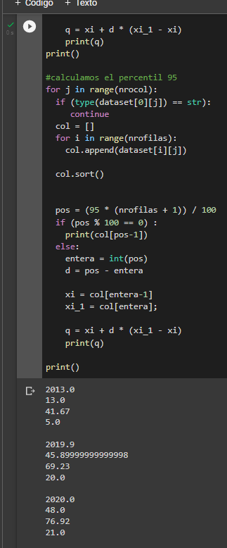
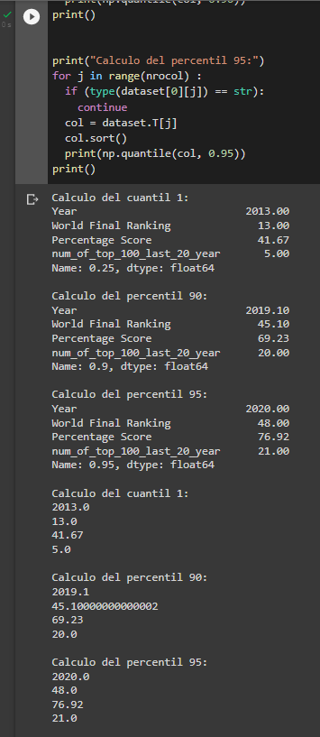
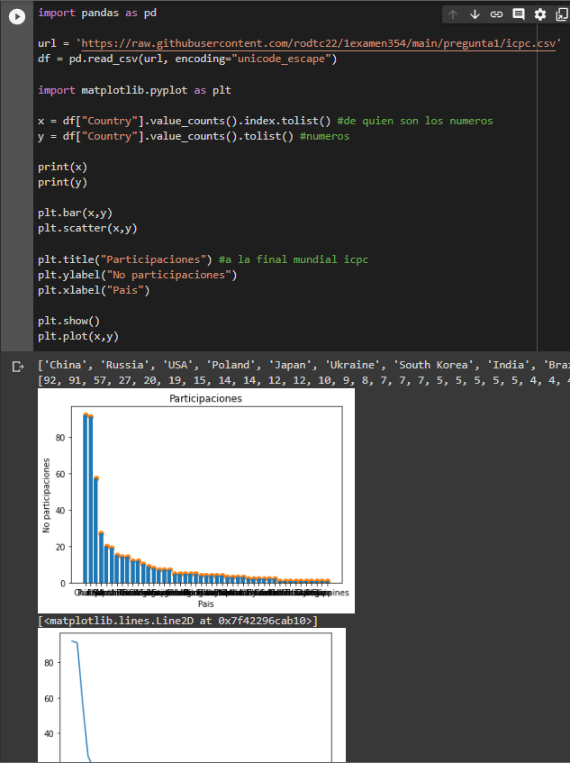

> NOTA: El dataset se encuentran en esta carpeta, y su nonmbre es ***icpc.csv***

# 1. Seleccione un dataset de su interes (datos tabularse minimo de 500 filas y almenos 5 columnas). 

## a. El calculo del 1er cuartil de datos, el percentil 90, 95 por columna; explique que significa cada caso mediante Python sin uso de librerias.

El primer cuartil esta dado por la formula:

    k * (n+1) / 4

    a) Para un resultado entero: es el valor en la posicion del resultado de la formula
    b) Para un resultado con decimales: x_i + d * (x_i+1 - x_i), 
    donde
        k es el valor del cuartil que queremos
        n es el tamanio del dataset
        x_i son los numeros en las posiciones que da la formula anterio

## b. Realice lo mismo del inciso (a) con el uso de numpy y pandas

El percentil esta dado por la formula:

    k * (n+1) / 10

    a) Para un resultado entero: es el valor en la posicion del resultado de la formula
    b) Para un resultado con decimales: x_i + d * (x_i+1 - x_i), 
    donde
        k es el valor del cuartil que queremos
        n es el tamanio del dataset
        x_i son los numeros en las posiciones que da la formula anterio

## c. Grafique los datos y explique su comportamiento (PYTHON)

