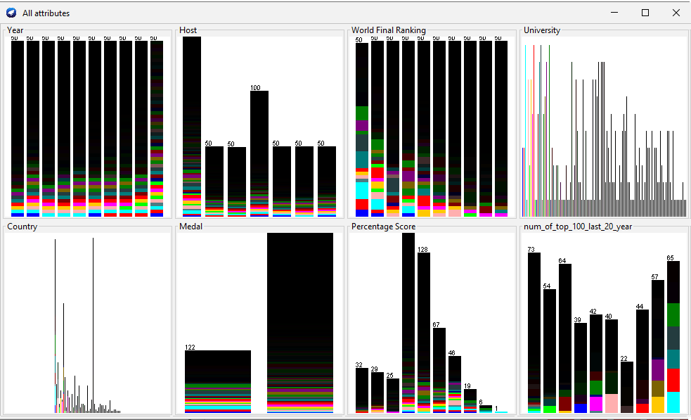

# 2. Del dataset anterior realice en WEKA, tres algoritmos de preprocesamiento

Primero convertimos nuestro archivo ***icpc.csv*** a ***icpc.arff***, para eso lo haremos con WEKA

## Discretize

## Normalizer

## Numeric Cleaner
