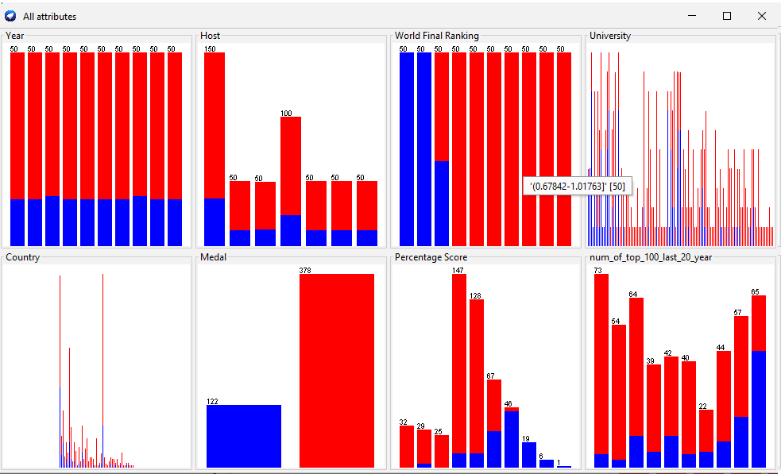
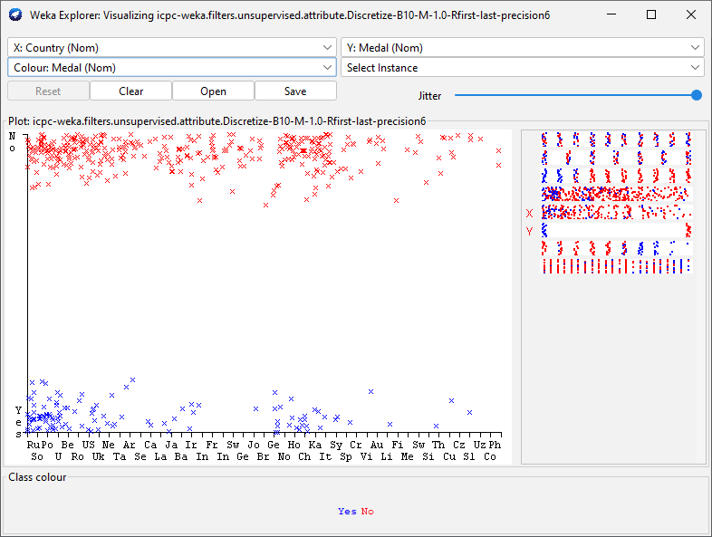
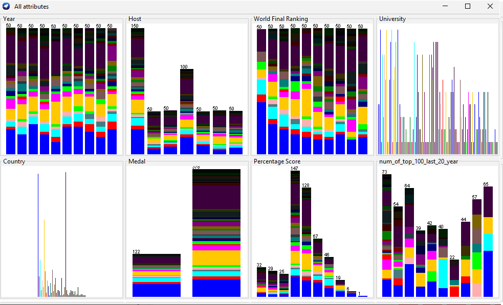
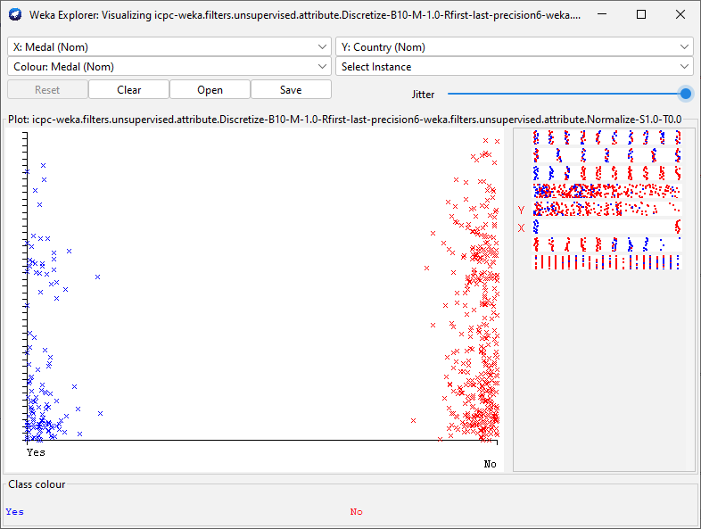
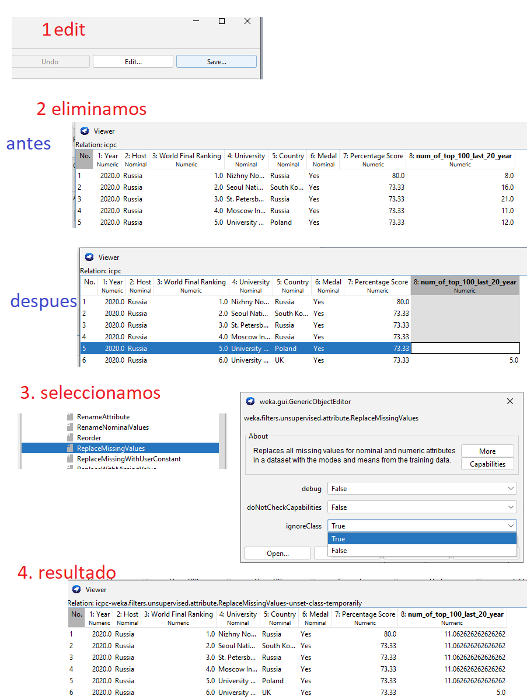

# 2. Del dataset anterior realice en WEKA, tres algoritmos de preprocesamiento

Primero convertimos nuestro archivo ***icpc.csv*** a ***icpc.arff***, para eso lo haremos con WEKA

## Discretize
Discretiza un rango numerico de atributos a atributos nominales (pone a los datos en un mismo contexto) es como que todos trataria de estar en una respectiva unidad mas o menos.

## Normalizer
 La normalización  significa ajustar los valores medidos en diferentes escalas respecto a una escala común, a menudo previo a un proceso de realizar promedios. Pero casos más complicados, la normalización puede referirse a ajustes más sofisticados donde la intención es conseguir todas las distribuciones de probabilidad que se ajustan a los valores para tratar de alinear a una distribucion normal.

## ReplaceMissingValues
Reemplaza todos los valores perdidos por atributos nominalies o numericos en el dataset, con la moda o media los datos de entrenamiento.

