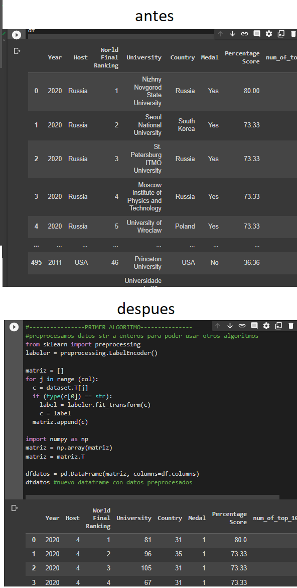
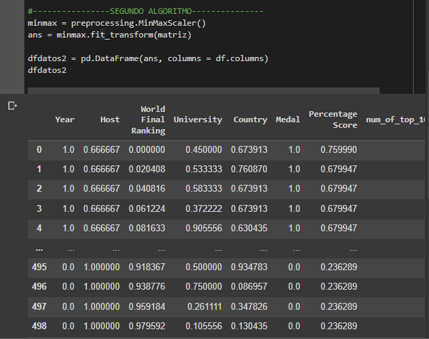
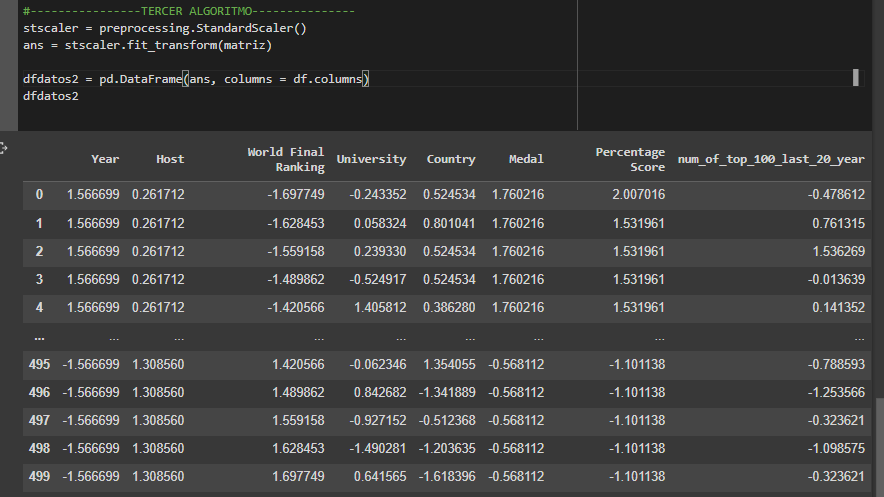

# 3. Del dataset anterior realice en PYTHON, tres algoritmos de preprocesamiento.

## Algoritmo 1 (Labeler)
Este algoritmo me permite convertir cadenas a enteros, para poder manipularlos segun me convenga, ej: Para cuando se necesitan matrices de solamente elementos numericos

## Algoritmo 2 (MinMaxScaler)

Este algoritmo me permite poner en escala a los datos, de acuerdo a rango entre el Maximo de ellos y el Minimo

## Algoritmo 3 (S)

Este algoritmo consiste en cambiar la distribucion de los datos talque la desviacion_estandar sea = 1, y la media = 0

Esto nos indica que tan dispersos estan nuestros datos, y calculando diferentes medidas de centralidad, en este algoritmo usa la media como medida de centralidad
#estandarizado = (X - media) /std

