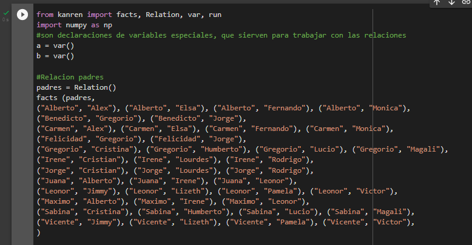
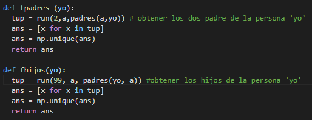
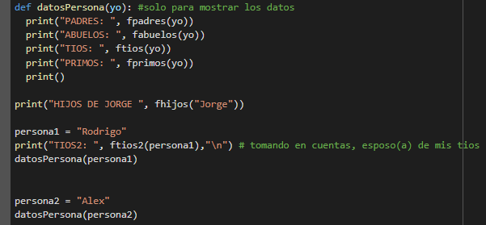
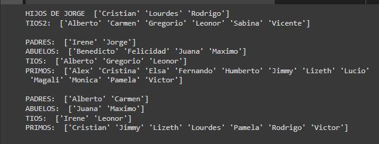

# 4. Con el uso de librerias en PYTHON, construya la dependencia de abuelos, tios, padres, primos e hijos de su familia.

Vamos a necesitar de ***KANREN*** para este ejercicio, importando algunas librerias 

y agregando algunas de las dependecias, tambien podriamos poner todas las dependencias de abuelo, tio, etc. Pero optaremos por otra forma de obtener estas dependecias con el uso de la dependencia anteriormente mostrada.

Vamos a explicar algunas de ellas:

y con esas dos podriamos obtener las demas, cabe recalcar que si hacemos uso de las dependencias , y el resultado seria el siguiente

