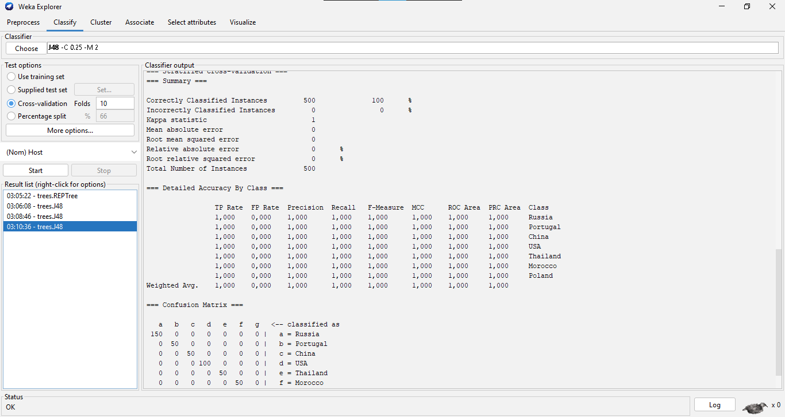

# 7. En WEKA grafique el arbol de decision del dataset seleccionado.

***Iniciamos el dataset en WEKA***

***Seleccionamos las opciones para ver el arbol de decision***

***Selecciono el tipo J48 y tenemos esto***

***Clickeamos ver tree***

***Podemos apreciar el arbol de decision***

## OTRO EJEMPLO

***Para eso cambiamos la clase y obtuvimos***

***Podemos apreciar en nuevo arbol de decision***

